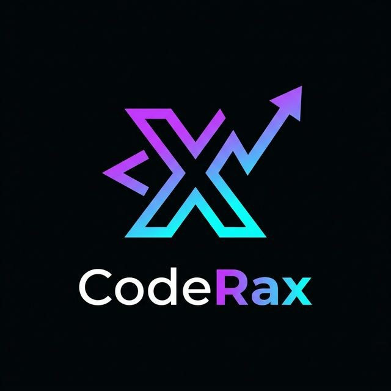

<div align="center">



# ⚔️ CodeRax

### A full-stack programming platform built for serious DSA practice, live battles, and AI-powered learning.

[](https://coderax-eosin.vercel.app)
[](https://your-render-url.onrender.com)
[](LICENSE)

</div>

---

## 🔗 Live Links

| Service | URL |
|---|---|
| 🌐 **Frontend** (Vercel) | `https://coderax-eosin.vercel.app` |
| 🚀 **Backend API** (Render) | `https://coderax.onrender.com`  |

---

## 📸 Overview

CodeRax is a full-stack programming platform. It goes beyond a simple problem list — offering a feature-rich workspace with a custom judging engine, real-time 1v1 coding battles, AI-powered revision tools, voice-driven mock interviews, and an interactive DSA visualizer.

---

## ✨ Features

### 🏟️ Problem Arena
- Curated DSA problems across Easy, Medium, and Hard difficulties
- Monaco-powered code editor with syntax highlighting
- Instant run & submission against visible and hidden test cases
- Solve history, daily challenge tracking, and difficulty breakdown stats

### ⚔️ DSA Arena — Live 1v1 Battles
- Real-time competitive coding battles via WebSockets
- ELO-based ranking system
- Queue-based matchmaking with cancel support
- Battle history and win-rate analytics on your profile

### 🧠 Revision Mentor (AI)
- AI-powered detection of weak topics based on your solve history
- Conversational revision — ask follow-ups, go deep on concepts (powered by Groq)
- Save AI-generated insights as persistent notes
- Spaced-repetition habits that adapt to your specific gaps

### 🎙️ Mock Interview (AI)
- Voice-driven interview simulation powered by Gemini AI
- Timed sessions matching real interview standards
- Post-interview performance review and communication feedback
- Graded transcripts saved to your profile

### 📐 DSA Visualizer
- Animated sorting algorithms (Bubble, Merge, Quick Sort, and more)
- Tree and graph traversal step-by-step animations
- Pause, step forward, and speed control at any point

### 🔐 Auth & Sessions
- Secure JWT authentication stored in HTTP-only cookies
- Redis-backed token blacklisting for logout invalidation
- Role-based access control (User / Admin)
- Rate limiting on AI endpoints

---

## 🛠️ Tech Stack

### Frontend
| Technology | Purpose |
|---|---|
| React + Vite | UI framework |
| Redux Toolkit | Global state management |
| Tailwind CSS | Styling |
| Monaco Editor | Code editor |
| Socket.io Client | Real-time battle communication |
| Axios | HTTP client |

### Backend
| Technology | Purpose |
|---|---|
| Node.js + Express | Server & REST API |
| MongoDB + Mongoose | Primary database |
| Redis | Session management & token blacklisting |
| JWT + Bcrypt | Authentication & password hashing |
| Socket.io | Real-time WebSocket communication |
| Groq API | AI chat & revision mentor |
| Gemini API | AI mock interview engine |
| Rate Limiter | Middleware for AI endpoint protection |

---

## 📂 Project Structure

```
CodeRax/
├── FrontEnd/
│   ├── src/
│   │   ├── pages/
│   │   │   ├── home/           # Landing page & feature showcase
│   │   │   ├── problem/        # Problem list & individual problem workspace
│   │   │   ├── battle/         # Battle lobby, arena, and results
│   │   │   ├── visualizer/     # DSA algorithm visualizer
│   │   │   ├── features/       # Revision Mentor & Mock Interview
│   │   │   ├── profile/        # User profile & stats
│   │   │   ├── admin/          # Admin problem creation panel
│   │   │   └── auth/           # Login & Signup
│   │   ├── components/         # Shared UI components
│   │   ├── services/           # Axios clients, Redux store, API helpers
│   │   ├── context/            # Theme context
│   │   └── utils/              # Feature catalog, visualizer algorithms
│   └── public/
│
└── BackEnd/
    └── src/
        ├── config/             # DB & Redis connection
        ├── controllers/        # Request handlers
        ├── interview/          # Gemini AI interview engine
        ├── judge/              # Code execution & judging
        │   ├── codeGenerator/  # C++ / Python boilerplate generation
        │   ├── inputBuilder/   # stdin formatting
        │   └── outputComparator/ # Output normalization & comparison
        ├── middleware/         # Auth, Admin, Rate-limit middleware
        ├── models/             # Mongoose schemas
        ├── routes/             # API route definitions
        ├── utils/              # Validators, Groq helper, ELO, matchmaking
        ├── workers/            # Matchmaker background worker
        ├── socketManager.js    # WebSocket event management
        └── server.js           # Entry point
```

---

## ⚙️ Local Setup

### Prerequisites
- Node.js v18+
- MongoDB instance
- Redis instance
- Piston API access (free, no key needed)
- Groq API key
- Gemini API key

### 1. Clone the Repository
```bash
git clone https://github.com/Ritik-Sharma28/CodeRax
cd CodeRax
```

### 2. Backend Setup
```bash
cd BackEnd
npm install
```

Create a `.env` file inside `BackEnd/src/`:
```env
PORT=3000
DB_CONNECT_KEY=mongodb+srv://<username>:<password>@<cluster>.mongodb.net/<dbname>
REDIS_PASSWORD=your_redis_password
JWT_SECRET=your_super_secret_jwt_key
COMPILER_API=https://emkc.org/api/v2/piston/execute
GROQ_API_KEY=your_groq_api_key
GEMINI_API_KEY=your_gemini_api_key
FRONTEND_URL=http://localhost:5173
```

```bash
npm start
```

### 3. Frontend Setup
```bash
cd FrontEnd
npm install
```

Create a `.env` file inside `FrontEnd/`:
```env
VITE_BACKEND_URL=http://localhost:3000
```

```bash
npm run dev
```

---

## 🧪 API Reference

> Base URL (Local): `http://localhost:3000`  
> Base URL (Production): *[https://coderax.onrender.com](https://coderax.onrender.com)*  
> Authentication: JWT token stored in HTTP-only cookie (`token`)

---

### 🔐 Authentication — `/auth`

| Method | Endpoint | Auth Required | Description |
|---|---|---|---|
| `POST` | `/auth/register` | ❌ | Register a new user account |
| `POST` | `/auth/login` | ❌ | Login and receive session cookie |
| `POST` | `/auth/logout` | ✅ | Invalidate session via Redis |

<details>
<summary><b>POST /auth/register — Request Body</b></summary>

```json
{
  "firstName": "John",
  "lastName": "Doe",
  "emailId": "john@example.com",
  "password": "StrongPas$123",
  "age": 25
}
```
</details>

<details>
<summary><b>POST /auth/login — Request Body</b></summary>

```json
{
  "emailId": "john@example.com",
  "password": "StrongPas$123"
}
```
</details>

---

### 📚 Problems — `/problem`

| Method | Endpoint | Auth Required | Role | Description |
|---|---|---|---|---|
| `GET` | `/problem/getAllProblem` | ✅ | User | Fetch all problems |
| `GET` | `/problem/problemById/:id` | ✅ | User | Get a specific problem by ID |
| `POST` | `/problem/create` | ✅ | **Admin** | Create a new coding problem |
| `PUT` | `/problem/update/:id` | ✅ | **Admin** | Update an existing problem |
| `DELETE` | `/problem/delete/:id` | ✅ | **Admin** | Delete a problem |

<details>
<summary><b>POST /problem/create — Request Body</b></summary>

```json
{
  "title": "Two Sum",
  "description": "Given an array of integers nums and an integer target...",
  "difficulty": "easy",
  "tags": "array",
  "problemSignature": {
    "functionName": "twoSum",
    "returnType": "vector<int>",
    "args": [
      { "name": "nums", "type": "vector<int>" },
      { "name": "target", "type": "int" }
    ]
  },
  "visibleTestCases": [
    { "input": "[2,7,11,15]\n9", "output": "[0,1]", "explanation": "nums[0] + nums[1] == 9" }
  ],
  "hiddenTestCases": [
    { "input": "[3,2,4]\n6", "output": "[1,2]" }
  ],
  "referenceSolution": [
    { "language": "cpp", "completeCode": "..." }
  ]
}
```
</details>

---

### 🖥️ Submissions — `/submission`

| Method | Endpoint | Auth Required | Description |
|---|---|---|---|
| `POST` | `/submission/run/:id` | ✅ | Dry run code against custom input |
| `POST` | `/submission/submit/:id` | ✅ | Submit code for judging vs all test cases |

<details>
<summary><b>POST /submission/submit/:id — Request Body</b></summary>

```json
{
  "code": "class Solution { ... }",
  "language": "cpp"
}
```

**Supported Languages:** `cpp` · `python` · `java`

**Possible Verdicts:** `Accepted` · `Wrong Answer` · `Time Limit Exceeded` · `Runtime Error` · `Compilation Error`
</details>

<details>
<summary><b>POST /submission/run/:id — Request Body</b></summary>

```json
{
  "code": "class Solution { ... }",
  "language": "python",
  "input": [
    { "input": "[2,7,11,15]\n9" }
  ]
}
```
</details>

---

### ⚔️ Matches — `/match`

| Method | Endpoint | Auth Required | Description |
|---|---|---|---|
| `POST` | `/match/queue` | ✅ | Join matchmaking queue |
| `POST` | `/match/cancel-queue` | ✅ | Leave matchmaking queue |
| `POST` | `/match/create` | ✅ | Create a private match |
| `POST` | `/match/join` | ✅ | Join a private match by code |
| `GET` | `/match/:matchId` | ❌ | Get match details |
| `POST` | `/match/:matchId/submit-final` | ✅ | Submit final solution in a battle |
| `POST` | `/match/:matchId/finish` | ✅ | Finalize and close a match |

---

### 🤖 AI Features — `/ai`

| Method | Endpoint | Auth Required | Rate Limited | Description |
|---|---|---|---|---|
| `POST` | `/ai/chat` | ✅ | ✅ | Doubt solver — ask questions about a problem |
| `POST` | `/ai/memory` | ✅ | ❌ | Save a revision memory note |
| `POST` | `/ai/quick-note` | ✅ | ❌ | Save a quick concept note |
| `GET` | `/ai/memories` | ✅ | ❌ | Fetch all revision memories |
| `DELETE` | `/ai/memory/:id` | ✅ | ❌ | Delete a revision memory |
| `POST` | `/ai/revision-chat` | ✅ | ✅ | AI-guided revision chat session |
| `POST` | `/ai/mock-interview/token` | ✅ | ❌ | Generate live interview session token |
| `POST` | `/ai/mock-interview/grade` | ✅ | ✅ | Grade completed interview session |
| `POST` | `/ai/mock-interview/save` | ✅ | ❌ | Save interview session to profile |

---

### 👤 User Profile — `/profile`

| Method | Endpoint | Auth Required | Description |
|---|---|---|---|
| `GET` | `/profile/me` | ✅ | Get current user's profile & stats |
| `GET` | `/profile/:userId` | ✅ | Get any user's public profile |

---

## 🏗️ Deployment

### Frontend → Vercel
1. Connect your GitHub repo to [Vercel](https://vercel.com)
2. Set root directory to `FrontEnd`
3. Add environment variable: `VITE_BACKEND_URL=https://your-render-url.onrender.com`
4. Deploy

### Backend → Render
1. Connect your GitHub repo to [Render](https://render.com)
2. Set root directory to `BackEnd`
3. Build command: `npm install`
4. Start command: `node src/server.js`
5. Add all environment variables from the `.env` template above

> ⚠️ Render free tier spins down after inactivity. The first request after idle may take ~30 seconds.

---

## 🤝 Contributing

1. Fork the repository
2. Create a feature branch: `git checkout -b feature/your-feature`
3. Commit changes: `git commit -m "feat: add your feature"`
4. Push to branch: `git push origin feature/your-feature`
5. Open a Pull Request

---

## 📄 License

This project is **proprietary and all rights reserved.**
 
You may **not** copy, use, modify, distribute, or build upon this code without explicit written permission from the author. See [LICENSE](LICENSE) for full terms.

---

<div align="center">

Built with ⚡ by Ritik Sharma

</div>
